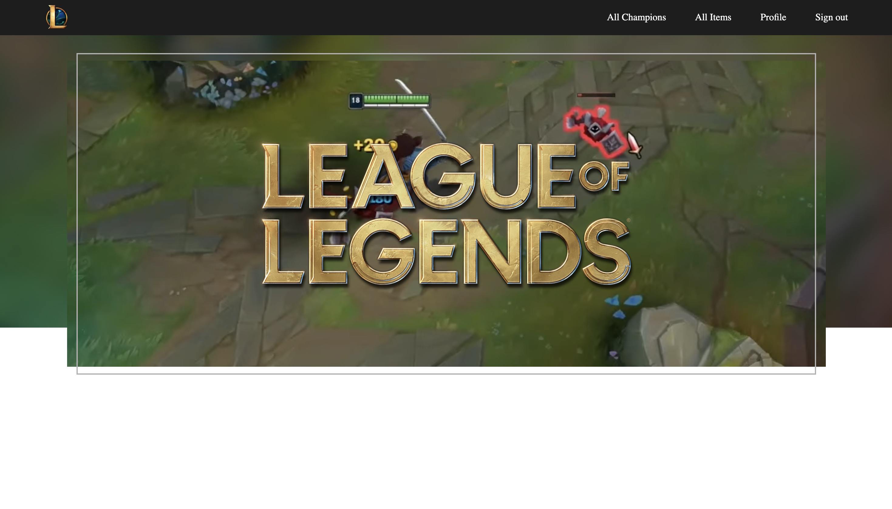
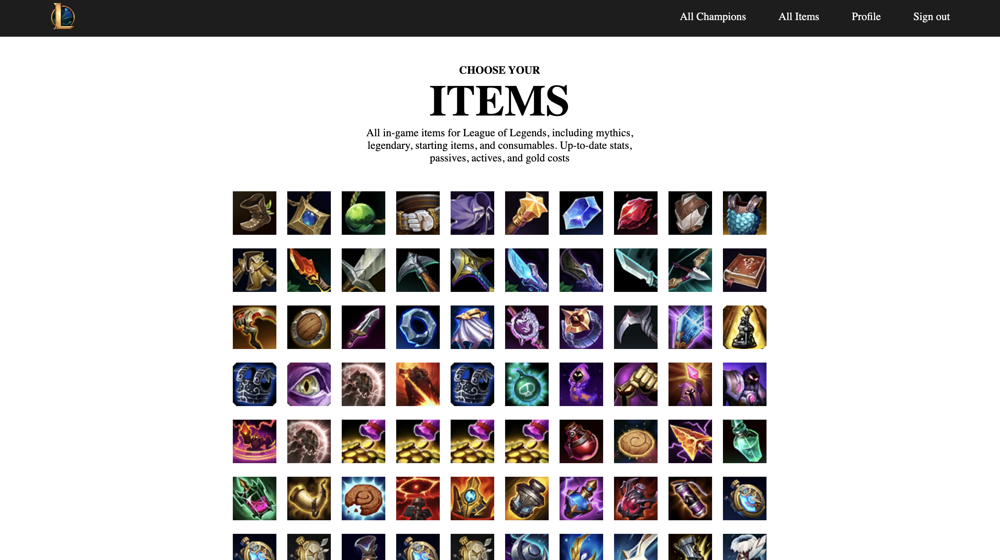
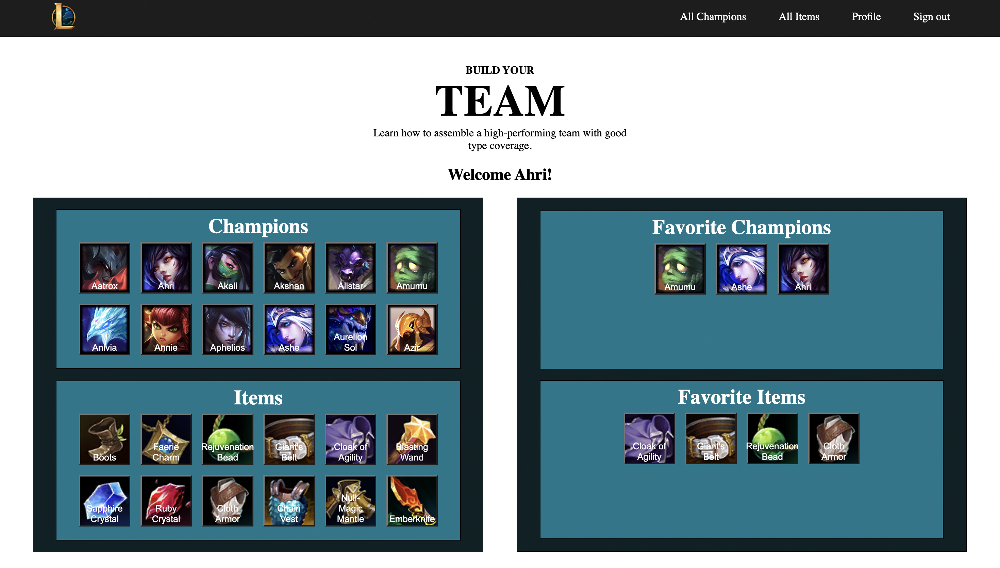

# League of Legends Fan Page

A interactive website that allows users to search for information about league champions/items.In addition users are able to save their favorite champions and or items to their own profile page.

# Live Site
- Backend repo: https://github.com/dmpellegrini/Legendary-Slayers-BE
- Backend deployed: https://legendary-slayers-be-production.up.railway.app/
- Frontend:

# Pages

# Team Members

- Lin Lin Lam https://github.com/durlinlin
- Suji Falcon https://github.com/vvsuji
- Victor Apez https://github.com/VictorApaez
- Danny Pellegrini https://github.com/dmpellegrini
- Jean Reye https://github.com/jeanreye4

# MVP
### Client(Front-end)

* Homepage
* Navbar (Signed In)
* Navbar (Not Signed In)
* Sign In / Sign Up
* Browse Champions
* Champion Info
* Browse Items
* User Profile

### Server(Back-end)

* Login/Authentification
* Champions CRUD
* Items CRUD
* Users CRUD
### Project Schedule

Day | Goal  |  Status  |
--- | ----  | :------: |
11/03 | Create repo, brainstorm idea & get approval| Complete |
11/04 | Start building back-end and front end wireframing | Complete |
11/07 | Continue working on back-end and front end| Complete |
11/08 | AM: Have back-end finished and deployed PM: Use deployed back-end to fetch data for front end components and continue working on front end styling and responsivenes| Complete |
11/09 | AM: Implement user authentification and CRUD capabilities PM: Deploy front-end and have all major aspects of project completed| Complete |
11/10 | Present project| Complete |